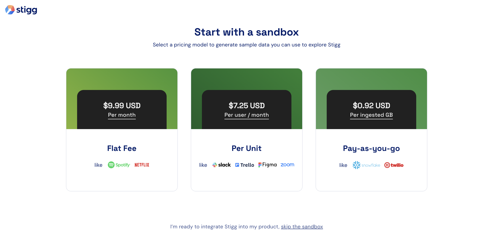
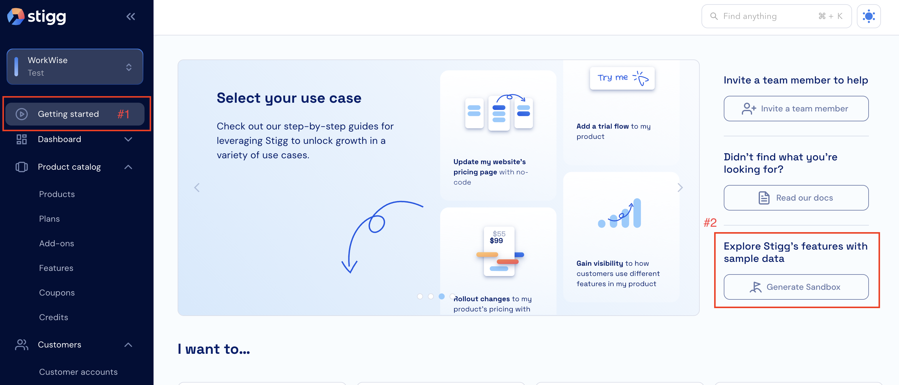

# Per-Unit Pricing (Stigg Example)

Example app demonstrating **feature gating** with **the per-unit pricing model** sandbox from [Stigg](https://www.stigg.io/). Includes a React frontend and a Node.js backend that enforce entitlements and report usage.

## Purpose

This repo is a **lightweight reference implementation** for:

- **Entitlements (boolean and metered)** — Metered features for Templates and Messages (usage limits, reporting when items are created). Boolean feature for Analytics (gated access).
- **Server-side enforcement** — The backend uses the Stigg Node SDK to validate entitlements and report usage / events.

## Setup

### Prerequisites

- **Node.js** 18+
- A **Stigg** account and project (for API keys and feature setup)

### Stigg setup

**First-time setup** — When you're new to Stigg, you'll see the pricing model screen below. **Choose "Per Unit"** as the pricing model.




**Existing account** — If you already have a Stigg project, go to **Getting started** in the sidebar. You'll see a screen like this:



Then **click "Generate sandbox"** to create a per-unit sandbox.

---

### 1. Clone and install

```bash
git clone <this-repo-url>
cd "Per-Unit Pricing"

# Backend
cd backend
npm install

# Frontend
cd frontend
npm install
```

### 2. Backend environment

In `backend/`, copy the env template and set your Stigg server API key:

```bash
cd backend
cp .env.template .env
```

Edit `backend/.env`:

| Variable | Description |
|----------|-------------|
| `STIGG_SERVER_API_KEY` | Stigg **server** API key (from your Stigg project) |
| `PORT` | Optional. Server port (default: `8000`) |

### 3. Frontend environment

In `frontend/`, copy the env template and set Stigg client config and API URL:

```bash
cd frontend
cp .env.template .env
```

Edit `frontend/.env`:

| Variable | Description |
|----------|-------------|
| `VITE_STIGG_CLIENT_API_KEY` | Stigg **client** API key (public, from your Stigg project) |
| `VITE_STIGG_CUSTOMER_ID` | Stigg customer ID used for this demo (must exist in Stigg) |
| `VITE_API_URL` | Backend base URL (e.g. `http://localhost:8000`). Optional; defaults to `http://localhost:8000` |

### 4. Run the app

Start the backend, then the frontend:

```bash
cd backend
npm start

cd frontend
npm run dev
```

- Backend: `http://localhost:8000`
- Frontend: `http://localhost:5173` (or the port Vite prints)

Use the app with the same customer you set as `VITE_STIGG_CUSTOMER_ID` so entitlements and usage line up.